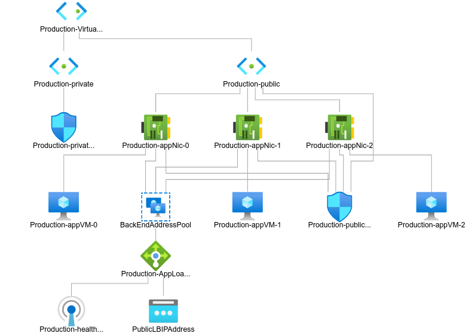
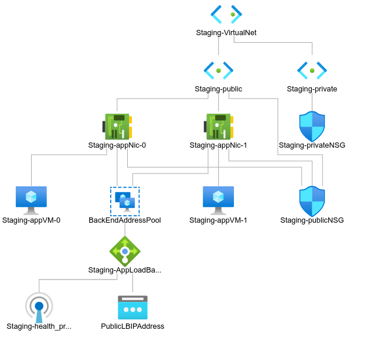

# <ins>Created two environments one for staging, another for production, configured them with ansible and install on them Weight Tracker.</ins>

#### <ins>Weight Tracker repository:</ins> https://github.com/alex-1pro/bootcamp-app.git

#  Diagrams of infrastructure
# <ins>Production:</ins>
 
# <ins>Staging:</ins>

# <ins>Ansible directory has playbook.yml file<ins>
## playbook.yml get variables from config_vars.

<h3><ins>Example of config_vars file:</ins></h3>
<pre>
servers: staging /** name of servers group for config **/
repo_path: /home/user/path_to_app_repository /** path to application directory **/
github_repo: https://github.com/alex-1pro/bootcamp-app.git /** link to application code repository **/
node_js: https://deb.nodesource.com/setup_14.x /** Script to install the NodeSource Node.js 14.x repo onto a Debian or Ubuntu system. **/
path_to_env: /home/user/path_to_env_file /** path to .env file **/
owner: user
group: user
</pre>

# <ins>Terraform directory<ins>
## This directory contains terraform files for create 2 environments.
## this project use module for create infrastructure.
### module repository: https://github.com/alex-1pro/IaC-terraform-project.git
